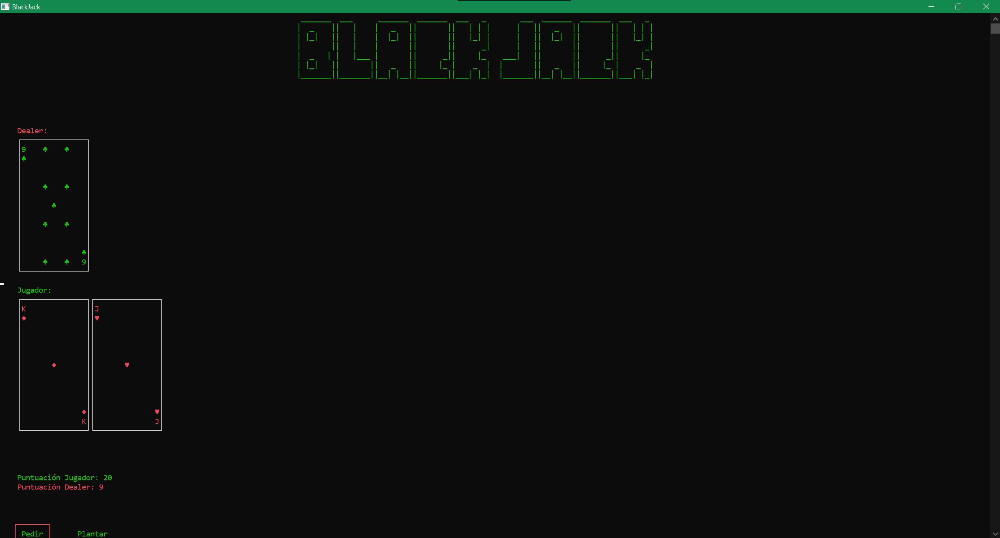

# BlackJack en C++ (Terminal GUI - Windows)

> Un juego de BlackJack completamente desarrollado desde cero en C++, con una interfaz de usuario basada en terminal específicamente diseñada para sistemas Windows.

## 📜 Descripción del Proyecto

Entre las funcionalidades destacadas se incluyen:

- Baraja dinámica con mezcla aleatoria (shuffling).
- Jugador y dealer con lógica independiente.
- Control de flujo del juego: repartir cartas, plantarse, pedir carta, y BlackJack automático.
- Interfaz gráfica mediante una terminal: uso de colores, bordes, animaciones simples y textos alineados.
- Soporte para reiniciar partida y juego continuo sin cerrar la aplicación.

## 🖥️ Tecnologías

- Lenguaje: C++
- Entorno: Consola de Windows (CMD/Powershell)

## 📦 Cómo Clonar

```bash
git clone git@github.com:IsokGta7/Black-Jack.git
cd Black-Jack
```

## 🛠️ Prerrequisitos

- **Sistema operativo**
  - **Windows 10/11**: funciona en **CMD** o **PowerShell** con soporte ANSI. Es necesario habilitar UTF-8 (`chcp 65001`) si tu perfil no lo usa por defecto.
  - **Linux**: cualquier terminal moderna con soporte ANSI/UTF-8 (GNOME Terminal, Konsole, Alacritty). Evita TTYs sin colores.
  - **macOS**: probado en Terminal.app e iTerm2 con UTF-8 habilitado; asegúrate de que la opción *Use bright colors for bold text* esté activa para ver los resaltados.
- **Compilador**: MinGW-w64 en Windows o `g++`/`clang++` con soporte **C++17** en Linux/macOS.
- **Herramientas**: `make` para builds rápidos. IDE recomendado: [Code::Blocks](https://www.codeblocks.org/downloads/) (Windows) o cualquier editor con integración de `make`.
- **Terminal**: al menos **100x30** caracteres para evitar cortes en las cartas y los marcos. En Windows el tamaño se ajusta automáticamente; en Linux/macOS conviene maximizar o ampliar el ancho antes de ejecutar.
- **Codificación**: el juego fuerza UTF-8 en Windows; en Unix asegúrate de que `LANG` y `LC_ALL` usen UTF-8 para que los bordes y palos se dibujen correctamente.

## 🧱 Compilación y Ejecución

### Windows (Code::Blocks o consola)
1. Abre **Code::Blocks** y carga `Blackjack.cbp`, o abre una consola en la raíz del proyecto.
2. Compila con **Build/F9** en el IDE, o ejecuta `mingw32-make` desde la consola si tienes MinGW en el `PATH`.
3. Ejecuta con **Run/Ctrl+F10** o lanzando el binario generado. Si la ventana se cierra al terminar, vuelve a abrir el ejecutable desde el IDE para ver el resumen.
4. Si ves caracteres extraños, ejecuta antes `chcp 65001` y expande la ventana a 100x30.

### Linux
1. Instala `g++`/`clang++` y `make` desde tu gestor de paquetes.
2. Corre `make` para compilar (`bin/Blackjack`) o `make test` para compilar y ejecutar las pruebas lógicas.
3. Lanza `./bin/Blackjack`. Se detectan las flechas a través de secuencias ANSI, así que evita emuladores minimalistas sin soporte.
4. Si la fuente no tiene glifos de caja/naipes, cambia a una monoespaciada con Unicode completo (p. ej. Fira Code, JetBrains Mono).

### macOS
1. Instala `g++`/`clang++` y `make` (con Xcode Command Line Tools o Homebrew).
2. Ejecuta `make` en la raíz para generar el binario.
3. Corre `./bin/Blackjack` desde **Terminal.app** o **iTerm2**. Mantén la ventana en **100x30** y con UTF-8; si usas iTerm2 activa *Report modifiers* para que las flechas se detecten bien.
4. Si la animación parpadea, desactiva el *ligado de fuentes* o usa el modo de pantalla completa para evitar recortes.

## 🕹️ Controles en el Juego

- **Flechas arriba/abajo:** navegar en el menú y entre opciones de juego.
- **Enter:** confirmar opción (`Pedir`, `Plantar`, `OK`, etc.).
- **Opciones principales:** *Jugar*, *Instrucciones*, *Créditos* y *Salir*.
- **Flechas izquierda/derecha:** alternar el **modo de juego** en el menú principal y en la pantalla de resultados.
- **Atajos rápidos:** `Ctrl+C` cierra la aplicación; evita usarlos si la animación está en curso para no dejar arte en pantalla.

## 🎮 Modos de juego y atajos

- **Clásico**: una mano estándar a 21, límite de 5 cartas por jugador y dealer, dealer se planta en 17.
- **Práctica**: misma regla que el Clásico pero las derrotas se registran como empate; ideal para aprender sin penalización.
- **Multironda**: serie al mejor de 3 rondas; conserva el puntaje entre manos.
- **Mano corta**: objetivo reducido a 18, el dealer se planta en 16 y el jugador gana automáticamente al llegar al máximo de cartas.
- **Cómo cambiar**: usa **←/→** en el menú principal. El modo activo aparece debajo del título y en el panel de resultados.

## ✨ Animaciones, estilos y compatibilidad

- **Animación de revelado**: las cartas y marcos aparecen con sombreado progresivo. Controla la cadencia con `BJ_ANIMATION_DELAY_MS=5` (milisegundos) o desactívala con `BJ_ANIMATIONS=off` / `BJ_DISABLE_ANIMATIONS=1` si la terminal parpadea.
- **Estilos de marco**: se usan bordes Unicode simples y dobles (`│─┐└╔╗╚╝`) y rellenos texturizados (`░▒▓`). Requieren fuentes monoespaciadas con soporte de dibujo de caja y UTF-8.
- **Compatibilidad de colores**: en Windows 10/11 se habilita automáticamente el modo ANSI. En Linux/macOS asegúrate de que tu terminal soporte secuencias de 256 colores para ver los degradados de la animación; si no, el juego sigue funcionando con relleno plano.
- **Tamaños y centrado**: el layout se centra según el tamaño reportado por la terminal. En Windows la ventana intenta ajustarse; en Linux/macOS conviene fijar 100x30 y desactivar el ajuste automático de anchura si tu emulador lo aplica.
- **Teclas extendidas**: en Windows se traducen los códigos extendidos de `_getch()` y en Unix se leen secuencias ANSI. Si una flecha no responde, revisa que la app de terminal no tenga capturas de teclas (p. ej. multiplexores).

## 🖥️ Consideraciones de Plataforma y Codificación

- La interfaz ahora utiliza glifos Unicode (bordes y palos) y fuerza la salida a UTF-8 en Windows para evitar símbolos incorrectos en Windows 10/11.
- El tamaño de ventana sólo se ajusta automáticamente en Windows; en otros sistemas el juego se centra mediante códigos ANSI sin cambiar la resolución.
- Si ves artefactos, valida que la terminal use UTF-8 y que las fuentes incluyan caracteres de caja y naipes.
- Las animaciones de revelado se pueden desactivar exportando `BJ_ANIMATIONS=off` o `BJ_DISABLE_ANIMATIONS=1` antes de ejecutar el binario, útil en consolas lentas.

## 🔧 Solución de Problemas

- **La ventana se corta o el texto se ve desalineado:** maximiza la consola o aumenta el tamaño de la ventana antes de iniciar.
- **Símbolos extraños en pantalla:** cambia la codificación de la consola a UTF-8 (`chcp 65001`) y asegúrate de no mezclar fuentes sin soporte Unicode.
- **No compila en Code::Blocks:** verifica que el kit MinGW esté instalado/seleccionado y que `Blackjack.cbp` se haya abierto desde la ruta correcta del clon (`Black-Jack`).
- **En Linux/macOS:** si el cursor queda visible o la consola no se limpia, valida que estés ejecutando en una terminal con soporte ANSI (p. ej. GNOME Terminal, iTerm2).

## 🖼️ Vista Previa



> La captura anterior se tomó en Windows 11 con CMD a 110x32 y `chcp 65001`. En Linux/macOS debería verse igual con soporte ANSI/UTF-8; en terminales sin colores los marcos aparecerán en monocromo.
